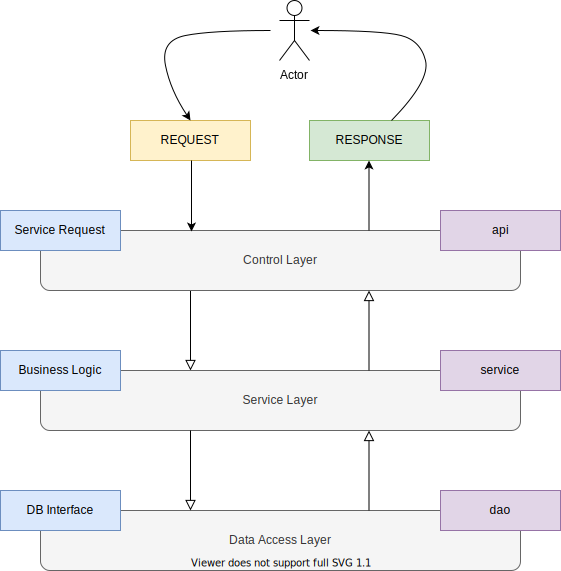

# Spring-Boot

RESTful API Development & Testing Using Spring Microservices

<p align="center">
  
</p>

## Setup

+ Install OpenJDK

  `brew install openjdk`

+ Install cURL

  `brew install curl`

+ Install command-line JSON processor

  `brew install jq`

+ Install [Insomnia REST client][1]

  `brew cask install insomnia`

+ For the system Java wrappers to find this JDK, symlink it with Java in `Library/`

  `sudo ln -sfn /usr/local/opt/openjdk/libexec/openjdk.jdk /Library/Java/JavaVirtualMachines/openjdk.jdk`

+ Set `JAVA_HOME`

  `export JAVA_HOME="/Library/Java/JavaVirtualMachines/openjdk.jdk/Contents/Home"`

+ Bootstrap application with [Spring Initializr][2]

+ Technical Specifications:

  + Project: Maven

  + Snapshot: 2.4.0

  + Project Metadata:

    + Packaging: JAR

    + Java Version: 15

    + Dependencies: Spring Web

## Execution

+ Execute application:

  `./mvnw spring-boot:run`

## API Testing

+ *POST* requests using `curl`:

  `./src/test/java/com/spring/app/post_people.sh`

  This script contains JSON data in the following format:

  ```
  curl --request POST \
    --verbose --include \
    --header 'Content-Type: application/json' 'Accept: application/json' \
    --data '
        {
            "name": "Adam"
        }' \
    http://127.0.0.1:8080/api/v1/person
  ```


+ *GET* request:

  (Using Insomnia will show formatted JSON output)

  ```
  curl http://127.0.0.1:8080/api/v1/person
  ```


+ *PUT* request:

  Get a UUID since it is a required parameter. The below command gets the `id` of the first record, without quotes (because of the `-r` flag):

  `uuid1=$(curl --silent http://127.0.0.1:8080/api/v1/person | jq -r '[.[].id] | .[0]')`

  ```
  curl --request PUT \
    --verbose --include \
    --header 'Content-Type: application/json' 'Accept: application/json' \
    --data '
        {
            "name": "Monique"
        }' \
    http://127.0.0.1:8080/api/v1/person/$uuid1
  ```


+ *DELETE* request:

  This time, get the `id` of the third record:

  `uuid3=$(curl --silent http://127.0.0.1:8080/api/v1/person | jq -r '[.[].id] | .[2]')`

  ```
  curl --request DELETE \
    --verbose --include \
    --header 'Content-Type: application/json' 'Accept: application/json' \
    http://127.0.0.1:8080/api/v1/person/$uuid3
  ```

[1]: https://insomnia.rest/
[2]: https://start.spring.io/
